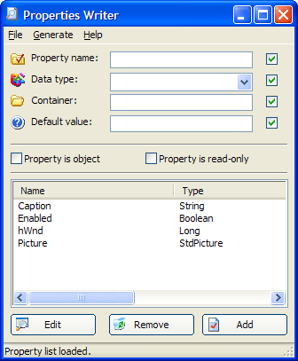



## ActiveX Properties Writer \(Very Helpful Tool\)

### Description

This is a tool I originally made for myself but I thought others might find it useful. If you write a lot of ActiveX controls, you probably spend a lot of time typing the code for properties. Well, now you don't have to, because this will generate all of the code for you, including: Property Container variable declarations, property get, set/let routines, UserControl_InitProperties(), UserControl_ReadProperties(), and UserControl_WriteProperties() events. I added in a few options in a Preferences form, like custom code indentation, commenting, etc. In the next version I plan to add a bunch more features, if you have an idea for one let me know. Please leave a comment if you find this useful. :) Also: Please read the help.htm file, it explains everything. You can load the file from the folder, or goto the Help -&gt; Help Contents menu from the program.
 
### More Info
 

             |
---                |---
**Submitted On**   |2006-02-14 18:25:24
**By**             |[Danny](https://github.com/Planet-Source-Code/PSCIndex/blob/master/ByAuthor/danny.md)
**Level**          |Beginner
**User Rating**    |4.3 (17 globes from 4 users)
**Compatibility**  |VB 5\.0, VB 6\.0
**Category**       |[Complete Applications](https://github.com/Planet-Source-Code/PSCIndex/blob/master/ByCategory/complete-applications__1-27.md)
**World**          |[Visual Basic](https://github.com/Planet-Source-Code/PSCIndex/blob/master/ByWorld/visual-basic.md)
**Archive File**   |[ActiveX\_Pr1973232142006\.zip](https://github.com/Planet-Source-Code/danny-activex-properties-writer-very-helpful-tool__1-64333/archive/master.zip)

